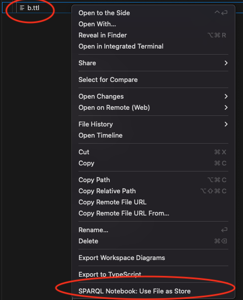

# Zazuko SPARQL Notebook 

## Overview

The **SPARQL Notebook for VSCode** extension enables users to run SPARQL queries directly within VSCode using a notebook-like interface with **Markdown** and **Code cells**. This versatile setup supports querying both remote HTTP/HTTPS SPARQL endpoints and local RDF files. The extension includes a **side panel for managing endpoint connections**, allowing you to seamlessly set up and switch between different SPARQL endpoints.

### Key Features
- **Query Execution on HTTP/HTTPS Endpoints**: Run SPARQL queries directly against remote SPARQL endpoints with HTTP/HTTPS protocols.
- **Binding Local Query Files to Code Cells**: Bind local `.sparql` or `.rq` files directly to code cells, allowing the contents of these files to be embedded within the notebook cell itself. This approach enables you to develop and document queries in a dedicated file while keeping the query available within the notebook for easy execution. Markdown cells can be used alongside these code cells to add explanations or documentation.
- **RDF File Querying**: Execute SPARQL queries on local RDF files (e.g., Turtle, RDF-XML) by providing a file path or pattern. This is especially useful when transforming data to RDF format and verifying the output with SPARQL before committing it to a triple store.
- **Markdown and Code Cells**: Use Markdown cells for explanations and Code cells for SPARQL queries. This format is ideal for creating a rich, interactive documentation environment around your queries.

While it’s a powerful tool for working with SPARQL and RDF data, the SPARQL Notebook is adaptable to a range of use cases beyond data science. Whether you’re building transformation workflows or simply documenting and testing queries. If there are any features missing for your specific use case, feel free to request them.


## HTTP Endpoint
To configure connections to SPARQL endpoints, click on the **SPARQL Notebook** icon on the left sidebar to open the **Connections** panel. This panel allows you to manage your SPARQL endpoint connections with ease.

To add a new connection, click the **+** icon in the top right corner. Both HTTP and HTTPS endpoints are supported.


To delete an endpoint connection, simply use the context menu (right-click on the connection) to remove it when it’s no longer needed.

> **Note:**
> 
> Using these connections is not "portable". It another user opens the notebook, they will not have the same connections.
> The connections are stored in the user settings of VSCode.

> **Note:**
> 
> Currently not supported:
> - SSL client certificates
> - Proxy

## Endpoints from Cells
You can also define endpoints directly in a cell. This is useful if you want to share the notebook with others and don't want to rely on the connections. This is very useful for sharing the notebook with others. But for it is limited to HTTP/HTTPS SPARQL endpoints without authentication or files (we come to that later). 

This is an example how you provide a SPARQL endpoint in a cell:

```sparql
#
# Test [endpoint=https://query.wikidata.org/bigdata/namespace/wdq/sparql]
# 
PREFIX wd: <http://www.wikidata.org/entity/>
PREFIX wdt: <http://www.wikidata.org/prop/direct/>
PREFIX wikibase: <http://wikiba.se/ontology#>
PREFIX bd: <http://www.bigdata.com/rdf#>

SELECT DISTINCT ?euMemberCountry ?euMemberCountryLabel ?headOfState ?headOfStateLabel
 
WHERE {
  ?euMemberCountry wdt:P463 wd:Q458;
      wdt:P35 ?headOfState .
  SERVICE wikibase:label { bd:serviceParam wikibase:language "[AUTO_LANGUAGE],en". }
}
```
The `[endpoint=https://query.wikidata.org/bigdata/namespace/wdq/sparql]` configures the endpoint for this cell.

## Local RDF Files
You can also query local files. This is useful if you want to query RDF files on your local machine. This is an example how you provide a file in a cell:

```sparql
#
# Test [endpoint=./data/00_intro.ttl]

SELECT ?s ?p ?o
WHERE {
  ?s ?p ?o
} LIMIT 10
```

You can provide a file path or a glob pattern.

Here are a few patterns:
```sparql
# [endpoint=./rdf/curia.nt]
```
or
```sparql
# [endpoint=./rdf/*]
```
or
```sparql
# [endpoint=rdf/*]
```
or
```sparql
# [endpoint=./rdf/{a,b}.ttl]
```
or
```sparql
# [endpoint=rdf/a.ttl]
# [endpoint=./rdf/b.ttl]
```

You can go here to see the [Glob Patterns Reference](https://code.visualstudio.com/docs/editor/glob-patterns).


There is another option to provide a file. You can navigate in the vscode file explorer to the file you want to query and then right-click on the file and select `SPARQL Notebook: Use File as Store`.



> **Note:**
> 
> File patterns in the comment are more flexible than the right-click option. But it is not doing the same thing. 
> If you use the flexible comment option then every time you execute the query it will create a new store and load the
> data from the file. If you use the right-click option then it will load the data only once and you can execute the query. But if you change the file then you have to reload the data in the same way.
> The right-click option is more efficient if you have a large file and you want to execute the query multiple times.


**FAQ:**

**Q:** Can I use a file with a different extension than `.ttl`?

YES

| File Extension | MIME Type          |
|----------------|--------------------|
| .ttl           | text/turtle        |
| .nt            | application/n-triples|
| .rdf           | application/rdf+xml|
| .trig          | application/trig   |
| .nq            | application/n-quads|

**Q:** Do you ship with a SPARQL endpoint?

YES. The notebook is using the amazing [Oxigraph](https://github.com/oxigraph/oxigraph) engine.

**Q:** It there a limit for local rdf files?

YES. The limit is currently approx 1G per file. But you can load multiple files. Just try it out.


## Local Query Files
You can also bind local `.sparql` or `.rq` files to code cells. This is useful if you want to develop and document queries in a dedicated file while keeping the query available within the notebook for easy execution. This is an example how you provide a file in a cell:


> **Note:**
> 
> If you change the cell content and save the notebook then the content of the file will be updated.

## Export to MARKDOWN

A notebook can be exported to a markdown file. Find the file in the vscode file explorer and right-click on the file and select `SPARQL Notebook: Export to Markdown`.


## Result Cells
Query results are displayed within dedicated result cells, with display formats tailored to different query types.

- **SELECT and ASK Queries**: Results from these queries are shown in a table format, making it easy to view and analyze tabular data.
- **CONSTRUCT and DESCRIBE Queries**: Results from these queries are rendered as a graph, providing a visual representation of RDF triples.

The notebook offers flexible display options through **renderers** specific to different MIME types. Some extensions also provide additional renderers for specific MIME types, enabling a more customized visualization experience for various data formats.
This extension is shipped with a few renderers. We include the extension ["Data Table Renderers from Random Fractals Inc."](https://marketplace.visualstudio.com/items?itemName=RandomFractalsInc.vscode-data-table) which provides better table rendering for large tables. 

You can change the result renderer like this: 


Then the top middle menu show the available renderers. Just choose the one you like.


> **Note:**
> 
> How to set the current renderer as default?
> To set the current renderer as default, you can use the VSCode command palette:
> 
> 1. Open the Command Palette (Ctrl+Shift+P or Cmd+Shift+P on Mac),
> 2. Type and select `Notebook: Save Mimetype Display Order`.

> **Note:**
>
> Our renderers are not designed for a large amount of data. Use the `Data Table Renderers from Random Fractals Inc.` extension for large data.

## SPARQL Anything

This has nothing todo with this notebook but i will show you how to use SPARQL Anything. We don't ship it with this extension but you can get it from https://sparql-anything.cc/.
You can run it in server mode and connect the notebook to it. 

Run sparql-anything in server mode:
```bash
java -jar sparql-anything-server-<version>.jar 
```

Then you can use it in the notebook like this:

```sparql
# [endpoint=http://localhost:3000/sparql.anything]

PREFIX fx: <http://sparql.xyz/facade-x/ns/>
PREFIX schema: <http://schema.org/>
PREFIX xyz: <http://sparql.xyz/facade-x/data/>
PREFIX rdf: <http://www.w3.org/1999/02/22-rdf-syntax-ns#>
PREFIX rdfs: <http://www.w3.org/2000/01/rdf-schema#>
PREFIX myns: <http://example.org/myns/>

CONSTRUCT {
   ?s ?p ?o .
} WHERE {
     # file relative to the SPARQL anything server
     SERVICE<x-sparql-anything:>{
        fx:properties fx:location "../input/2024-03-08 AKN4ZH ACT A0.xml";  
                      fx:media-type "application/xml".  
            ?s ?p ?o .
    }
}
```