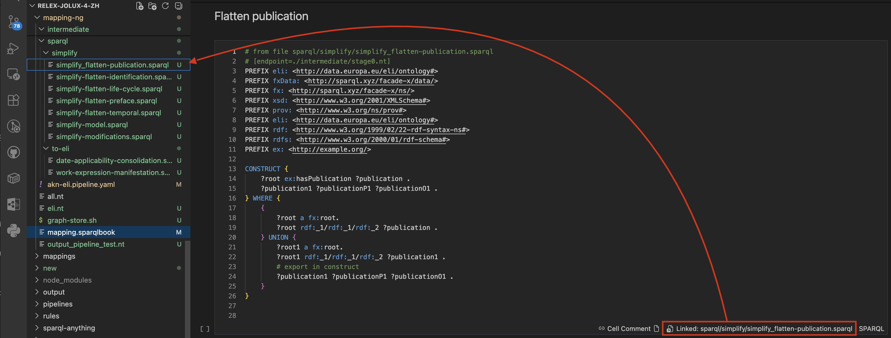
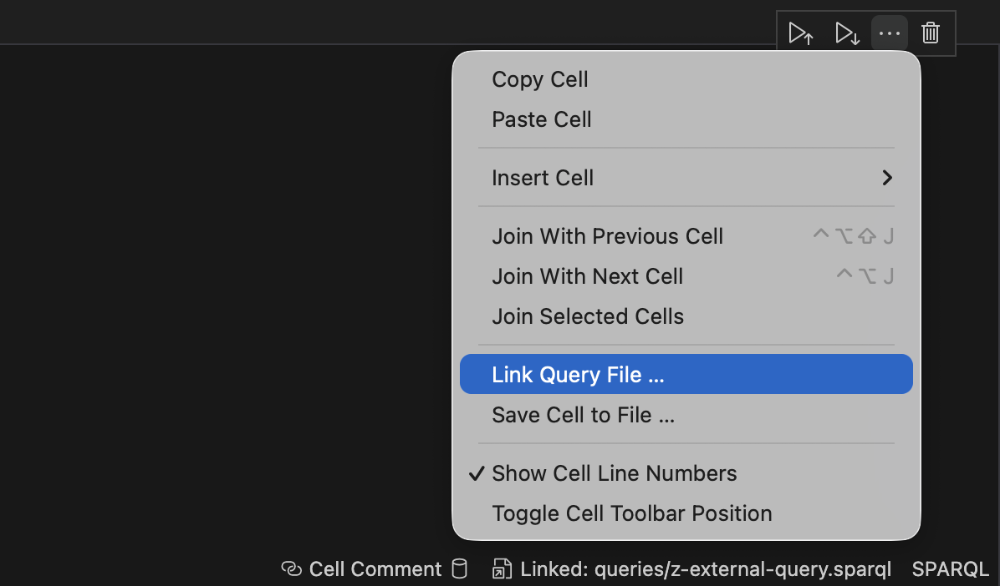
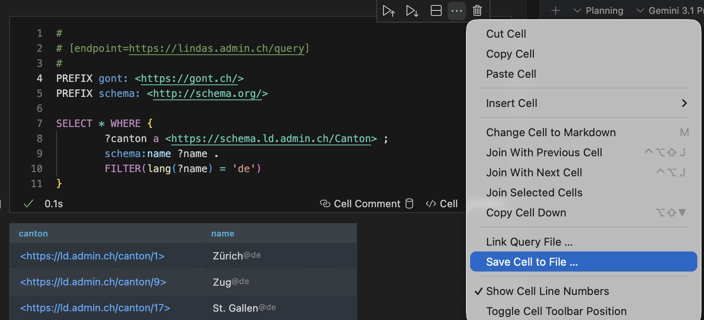
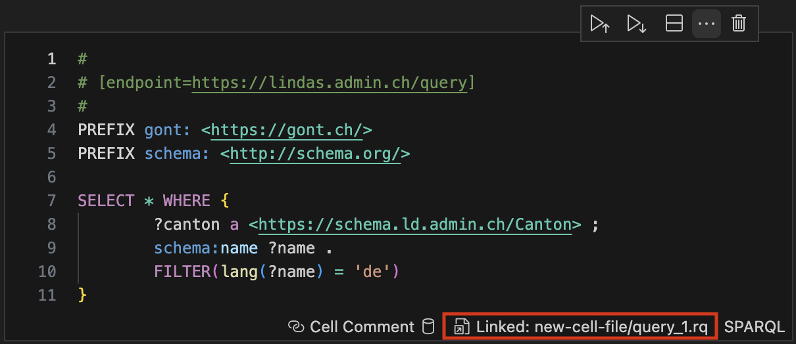
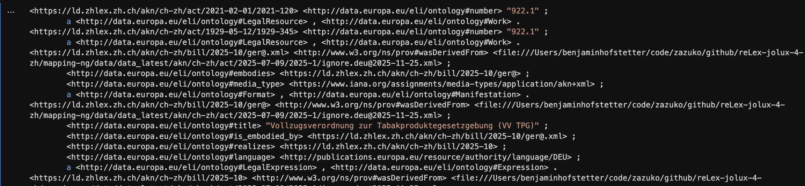
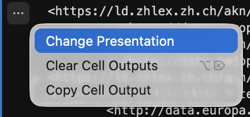
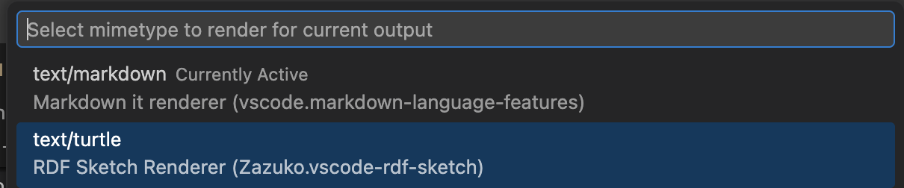
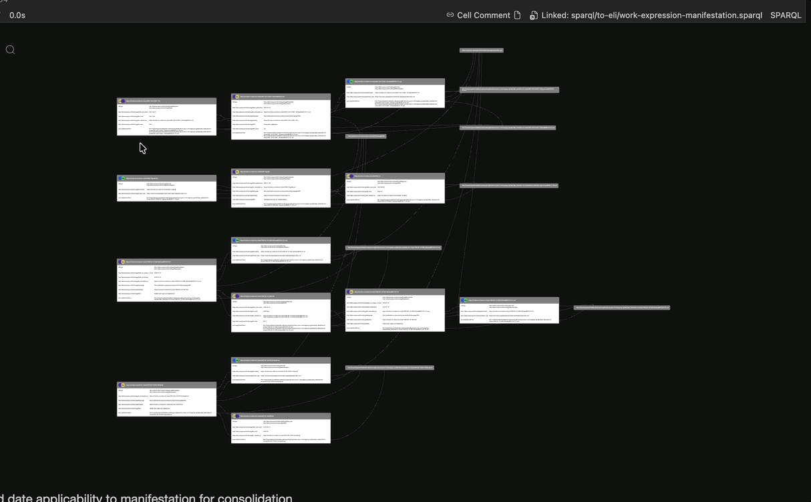

# Use Cases

SPARQL Notebook is a versatile tool that supports a wide range of workflows when working with RDF data and SPARQL queries. It can be used for exploration, documentation, query development, and data transformation.  
If you have an interesting use case, feel free to share it.

The following sections describe common ways SPARQL Notebook is used.

---

## Learning SPARQL and RDF

SPARQL Notebook provides a practical environment for learning **SPARQL** and **RDF** without requiring a full database installation. Users can experiment with queries directly on local RDF files.

There are two ways to query RDF files:

1. Navigate to a Turtle file and select **"Use file as Store"** from the context menu.
2. Configure an endpoint using a comment in a query cell:

```sparql
# [endpoint=./data.ttl]
```


The second approach is commonly used because it allows **GLOB pattern matching**. Each time a query is executed, the referenced files are loaded into a **WASM Oxigraph store**, and the query is executed against that temporary store.

The first option behaves differently. It creates a WASM Oxigraph store and loads the file into it once. This approach can be more performant because the data is only loaded once. However, if the file changes, the store must be reloaded manually.

In practice, the second approach is often preferred because it simplifies iteration during development.

---

## Replacement for Multiple YASGUI Tabs

When using tools such as **YASGUI**, it is common to open many query tabs while exploring a dataset. For example, a user might start with an exploratory query, discover an interesting pattern, open another tab to investigate further, and continue this process multiple times.

SPARQL Notebook supports a similar workflow but organizes the exploration **vertically in a single document**. Queries are written from top to bottom, often accompanied by markdown comments describing intermediate findings.

This structure makes it easier to:

- Track the exploration process
- Document observations
- Reproduce query sequences later

---

## Document External SPARQL Queries

In many projects, SPARQL queries are stored in a folder as `.sparql` or `.rq` files. SPARQL Notebook can be used to **document and execute these queries directly**.

A notebook cell can reference an external query file, allowing the query logic to remain in the file while the notebook provides documentation and context.



You can link a query file to a cell using the **cell context menu**.



This approach enables:

- Documentation of existing queries
- Execution of queries within a reproducible workflow
- Clear separation between query logic and documentation

---

## Save a Cell Query to a File

Queries developed interactively in a notebook cell can be saved to a file.

This action is available through the **cell context menu**.



When a query is saved to a file, the cell automatically becomes **linked to that file**. The link status is visible in the cell footer.



This workflow allows users to:

- Prototype queries interactively
- Persist them as reusable `.sparql` or `.rq` files
- Maintain synchronization between the notebook and external query files

---

## Construct Queries with RDF Sketch Renderer

Construct queries return RDF data, typically serialized as **Turtle**.

SPARQL Notebook does not serialize the result itself. Instead, it sets the HTTP `Accept` header to `text/turtle` and returns the query result directly.



For improved visualization, the **RDF Sketch** extension can be installed. It provides a Turtle notebook renderer that can display RDF graph structures visually.

Install the extension from:

- [VScode Market Place](https://marketplace.visualstudio.com/items?itemName=Zazuko.vscode-rdf-sketch)
- [VSX](https://open-vsx.org/extension/Zazuko/vscode-rdf-sketch)

After installation, change the result presentation by selecting **Change Presentation** and choosing **RDF Sketch** as the renderer.





Once selected, RDF Sketch visualizes the result of a construct query, enabling interactive exploration of the generated RDF graph.



---

## Mapping XML Data to RDF

SPARQL Notebook can also be used to implement **data transformation pipelines**, such as mapping XML data to RDF.

In this scenario, XML data is incrementally transformed into a target RDF model through a series of SPARQL-based processing steps.

### Transformation Overview

The transformation process typically consists of the following stages:

1. **Input Data**
   - XML data serves as the source dataset.

2. **Triplification**
   - The XML data is converted into RDF using a triplifier such as **SPARQL Anything**.

3. **Model Simplification**
   - A set of SPARQL queries (stored in **folder 1**) simplifies the generated RDF structure.

4. **Intermediate Storage**
   - The resulting RDF graph is stored for further processing.

5. **Mapping to the Target Model**
   - A second set of SPARQL queries (stored in **folder 2**) maps the simplified RDF graph to the desired **target ontology or data model**.

6. **Final Output**
   - The final RDF dataset is exported to a file.

### Transformation Pipeline

Conceptually, the pipeline can be represented as:
```
XML → Transform → Store → Transform → Store → Transform → Store → Dump result to file
```


Each transformation step refines the RDF graph and prepares it for the next stage of processing.

### Implementing the Pipeline with SPARQL Notebook

Within the notebook, each transformation step is represented by a **cell that executes an external SPARQL query file**.

This structure enables the notebook to function as both a **development environment** and **documentation artifact** for the transformation pipeline.

Key advantages include:

- **Documentation**  
  The notebook provides a clear, step-by-step description of the transformation workflow.

- **Query Development**  
  Transformation queries can be iteratively developed and tested.

- **Intermediate Inspection**  
  Intermediate RDF graphs can be inspected after each step.

- **Reproducibility**  
  The complete pipeline can be executed consistently from the notebook.

### Validation

After the transformation pipeline is complete, **validation queries provided by the customer** can be executed against the resulting RDF dataset. These queries verify that the output conforms to the expected structure and content of the target model.


## SPARQL Anything

This has nothing todo with this notebook but i will show you how to use SPARQL Anything. We don't ship it with this extension but you can get it from https://sparql-anything.cc/.
You can run it in server mode and connect the notebook to it. 

Run sparql-anything in server mode:
```bash
java -jar sparql-anything-server-<version>.jar 
```

Then you can use it in the notebook like this:

```sparql
# [endpoint=http://localhost:3000/sparql.anything]

PREFIX fx: <http://sparql.xyz/facade-x/ns/>
PREFIX schema: <http://schema.org/>
PREFIX xyz: <http://sparql.xyz/facade-x/data/>
PREFIX rdf: <http://www.w3.org/1999/02/22-rdf-syntax-ns#>
PREFIX rdfs: <http://www.w3.org/2000/01/rdf-schema#>
PREFIX myns: <http://example.org/myns/>

CONSTRUCT {
   ?s ?p ?o .
} WHERE {
     # file relative to the SPARQL anything server
     SERVICE<x-sparql-anything:>{
        fx:properties fx:location "../input/2024-03-08 AKN4ZH ACT A0.xml";  
                      fx:media-type "application/xml".  
            ?s ?p ?o .
    }
}
```

# Share Your Use Case

> If you have an interesting use case or have implemented a unique transformation pipeline, we would love to hear about it! Please feel free to reach out or submit a Pull Request to contribute your examples to this documentation.

Maybe you are not aware of it but open source projects like this often have thousends of users. But you don't know them and you don't get any feedback. So it's a good idea to share your use case with the community.

And if you are a company and you are using this tool in production, please consider sponsoring the project. This will help us to continue developing and maintaining this tool.


